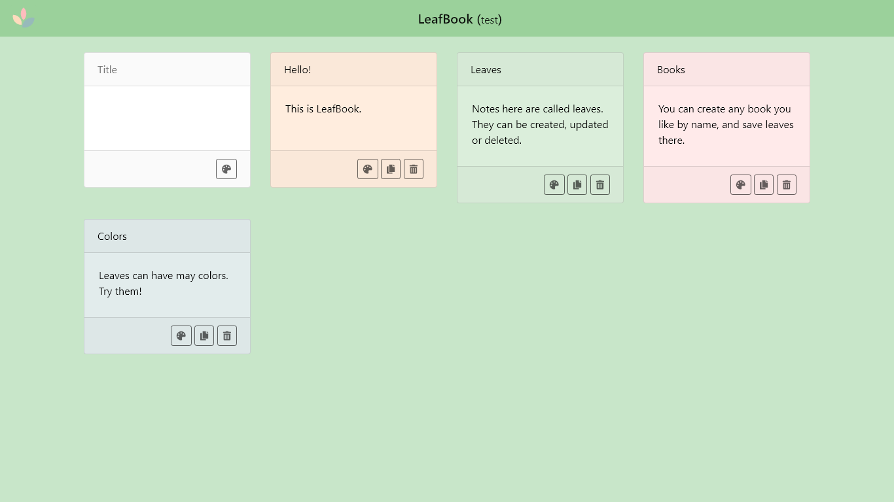

#  LeafBook

A simple note taking app 🍃

## About

LeafBook is a simple app to take notes. You can create any book by name and add notes called leaves in each of them. There is no login, so you can have access to your notes in every computer just by remembering your book name.

## How it works?

The site is a Single Page application made on Vue. It uses some libraries:

* [Vue Router](https://github.com/vuejs/vue-router), for navigation, of course
* [Vuex](https://github.com/vuejs/vuex) to manage state
* [axios](https://github.com/axios/axios) to query the API
* [vue-autosize-area](https://github.com/egoist/vue-autosize-textarea) to manage the size of the leaves
* [vue-clipboard2](https://github.com/Inndy/vue-clipboard2) for easily copying to clipboard
* [vue-toasted](https://github.com/shakee93/vue-toasted) to show notifications

The backend is made on Laravel, and it can be found [on its own repo](https://github.com/bul-ikana/leafbook-backend)